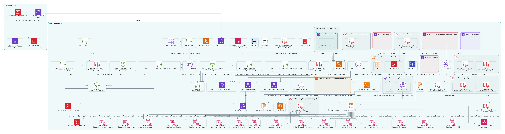

# HollyBike

## Frontend

Frontend de l'application HollyBike. Développé avec Preact. <br>

Le frontend utilise `Bun` et `Vite` pour le développement.

### Installation des dépendances

```shell
bun i
```

### Lancer le frontend pour le développement

Pour lancer le frontend en mode développement (avec vite).

```shell
bun run dev
```

## Backend

Backend de l'application HollyBike. Développé en kotlin avec le framework Ktor. <br>

Le backend est compilé avec GraalVM pour être exécuté en tant que binaire natif.

### Lancer le backend

Pour lancer le backend, vous pouvez utiliser le script Gradle `run`.
Pour changes les variables d'environnements, vous pouvez mettre à jour le fichier `app.json` à la racine du projet.

```shell
./gradlew run
```

### Compiler le backend

#### Prérequis

Pour compiler le backend en tant que binaire natif, vous devez avoir GraalVM installé sur votre machine. <br>

Vous devez également avoir un JDK 21 installé sur votre machine.

#### Compilation

Pour compiler le backend, vous pouvez utiliser le script Gradle `nativeCompile`.

```shell
./gradlew nativeCompile
```

#### Lancer le binaire natif

Pour lancer le binaire natif, vous pouvez utiliser le binaire généré dans le dossier `build/native/nativeCompile`.

```shell
./build/native/nativeCompile/hollybike_server
```

### Lancement de l'agent GraalVM

Pour lancer l'agent GraalVM, vous pouvez utiliser l'option -Pagent sur les tests par exemple.

```shell
./gradlew -Pagent test
```

Pour copier les métadatas générées par l'agent, vous pouvez utiliser la tâche `metadataCopy`.

```shell
./gradlew metadataCopy
```

## Base de donnée

Base de donnée utilisée : PostgreSQL

### Nomenclature

- Les noms de tables sont au pluriel.
- Les clés primaires sont des entiers auto-increment nommés `id_<nom_de_l'entité_au_singulier>`.
- Les tables de jointures sont nommées par le nom des 2 tables jointes au pluriel séparé par un verbe à l'infinitif.
- Les clés étrangères sont nommées par l'entité pointée.
- Privilégier les majuscules pour les mots clé SQL dans le changelog.
- Privilégier le plus possible l'utilisation de `IF NOT EXIST` afin de pouvoir exécuter à nouveau les scripts en cas de
  problème quelconque sur la base.

### Docker

Pour lancer une base de donnée PostgreSQL en local, vous pouvez utiliser le docker-compose fourni.

```shell
docker-compose up -d
```

### Changelog

Le changelog doit être écrit à la main dans le fichier `backend/src/main/resources/liquibase-changelog.sql`  
Un nouveau changeset dans le changelog doit commencer par un commentaire contenant le nom de l'auteur du changeset,
ainsi que l'id du changeset (entier incrémenté de 1 en 1), et le cas échant le contexte dans lequel il doit s'exécuter.

#### Contexte

Il existe 3 contextes différents
- `dev`
- `cloud`
- `premise`

Le contexte `dev` ne s'exécute qu'en environnement de dev (le mode développement de l'API doit être activé).

Le contexte `cloud` s'exécute en version cloud (présence de la variable d'environnement `CLOUD=true`).  
Dans le cas contraire le contexte `premise` est exécuté.

Pour ne pas sélectionner un contexte, utiliser un `!` devant le contexte.

Les mots clé `all` et `none` sont également disponible pour sélectionner respectivement tout et aucun contexte.

#### Exemples

`--changeset author:id [context:context1[,context2]]`

`--changeset denis:1`

`--changeset denis:2 context:dev`

`--changeset denis:3 context:dev,!premise`

`--changeset denis:4 context:none`

### Lancer la migration

La migration de la base de données est faites automatiquement au lancement du backend.

## Infrastructure

L'infrastructure est gérée avec Terraform.

Pour définir les variables Terraform, créer un fichier `terraform.tfvars` à la racine du
dossier `packages/infrastructure/project`.

Le projet nécessite les credentials configurés AWS pour fonctionner.

### Schéma



### Appliquer les changements

Pour appliquer les changements Terraform, il est recommandé de laisser la CI/CI s'en charger.

## Application Flutter

L'application mobile est développée en Flutter.

### Installation des dépendances

```shell
flutter pub get
```

### Lancer l'application

Utiliser les outils fournis par Android Studio.

## CI/CD

### Pull Request

À la création d'une PR, un pipeline est déclenché pour vérifier la qualité du code.

Un filtre est appliquer pour ne lancer la pipeline que sur les packages concernés par les changements.

### Merge

À la fusion d'une PR, un pipeline est déclenché pour déployer l'infrastructure avec Terraform.

### Release

Pour créer une release et déployer le projet, il suffit de lancer le workflow Manuel `Release & Deploy` et de mettre en
paramètre le numéro de version de la release.

# Contributors

<table>
  <tbody>
    <tr>
      <td align="center" valign="top" width="14.28%"><a href="https://github.com/MacaronFR"><br /><sub><b>MacaronFR</b></sub></a></td>
      <td align="center" valign="top" width="14.28%"><a href="https://github.com/enzoSoa"><br /><sub><b>Enzo Ayrton Soares
</b></sub></a></td>
      <td align="center" valign="top" width="14.28%"><a href="https://github.com/Loic-Vanden-Bossche"><br /><sub><b>Loïc Vanden Bossche
</b></sub></a></td>
    </tr>
  </tbody>
</table>